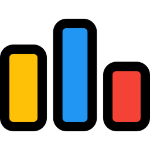
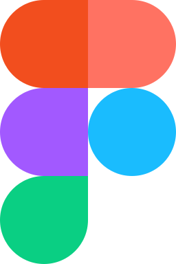

#### <!-- Header -->

  <h1>Hi
    
    I'm Kumar Priyanshu
  </h1>
  <h4><code>git commit -m "Hello, I'm a Full Stack Web Developer"</code></h4>

####

  
  
  

# <!-- Introduction -->

- 💬 **Ask me about:** `var topics = [ "HTML", "CSS", "Javascript", "C", "C++", "Java", "Python" ]`
- 📫 **How to reach me:** [kpriyanshu2003@outlook.com](mailto:kpriyanshu2003@outlook.com)
- 📄 **Know about my work & experiences:** [resume](https://drive.google.com/file/d/1-zJ2OBriv3l1Y2ih8u6d8L0-rZJt6PNo/view?usp=drive_link)
- ✒️ **Fun fact:** Always trusting my intuition
- ☕ Feel Free ... to reach out to me if you have any sort of recommendations ! We will definitely discuss that over a cup of coffee

#### <!-- Social -->

  <h3>Connect with me:</h3>
  
  
  
  
  
  
  

#### <!-- Skills -->

  <h3>Skills:</h3>
  
  
  
  
  
  
  
  
  
  
  
  
  
  
  
  
  
  
  
  
  
  
  
  
  
  
  
  
  
  
  
  

#### <!-- Stats -->

  <h3>My Github Stats</h3>
  

<!-- <h3 align="left">Support:</h3> -->
<!-- 

 -->
